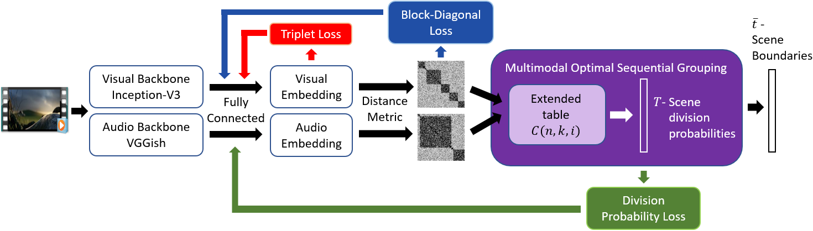

# LearnableOSG
Code sample of our paper Learnable Optimal Sequential Grouping for Video Scene Detection

[Paper](https://dl.acm.org/doi/abs/10.1145/3394171.3413612)

See osg_vsd_train.py for example usage

## Rquirements
Install conda environment using environment.yml file

## Data
Download OVSD h5 files from this link:
https://www.dropbox.com/s/842oy64wi6xnlq0/h5.zip?dl=0
